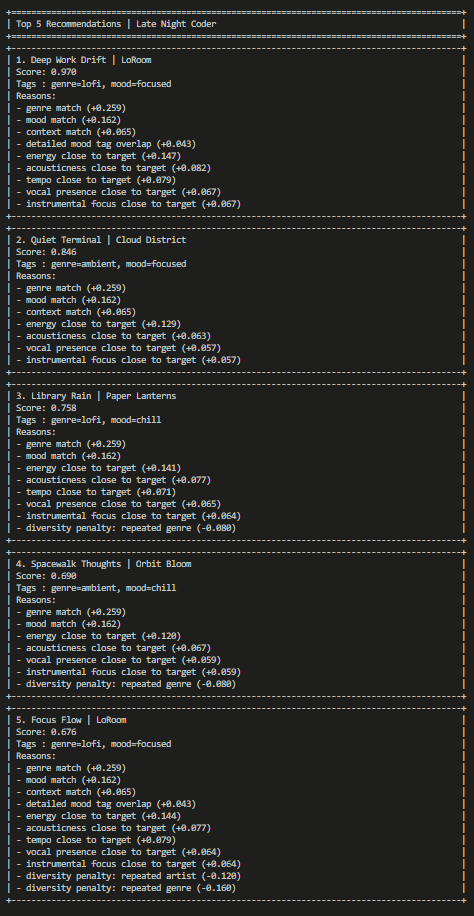
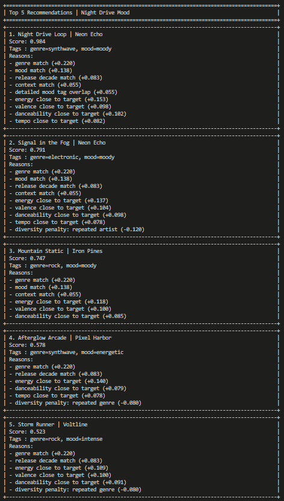
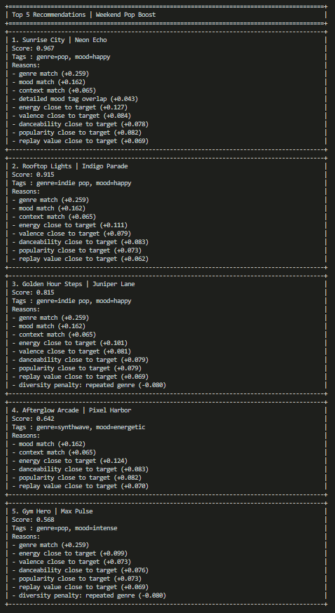
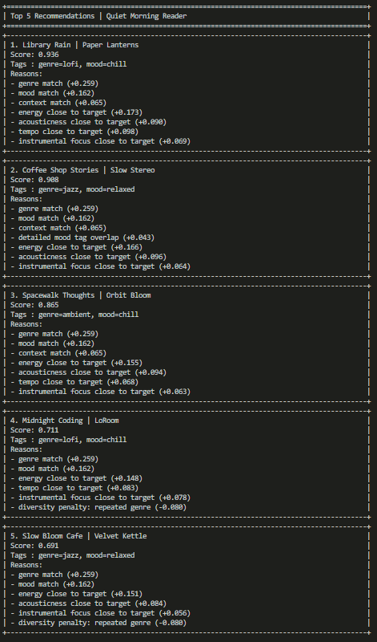
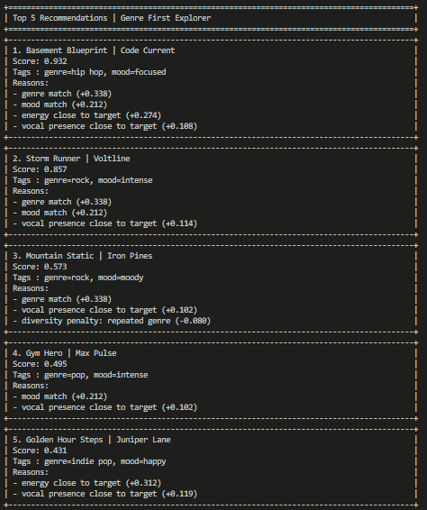

# Music Recommender Simulation

## Project Summary

This project simulates a small explainable music recommender that matches songs to structured user taste profiles. My version extends the starter system with richer song metadata such as listening context, release decade, detailed mood tags, popularity, vocal presence, instrumental focus, and replay value so it can distinguish between profiles like a late-night coder, a night-drive listener, or a weekend pop fan more accurately.

---

## How The System Works

In real-world music apps, recommendation systems combine many signals like listening history, skips, likes, context, and behavior from similar users. This project is intentionally simpler and focuses on clear, explainable matching based on a user's stated preferences.

- Each song includes core fields like `genre`, `mood`, `energy`, `valence`, `danceability`, `tempo_bpm`, and `acousticness`, plus richer metadata such as `release_decade`, `listening_context`, `detailed_mood_tags`, `popularity_100`, `vocal_presence`, `instrumental_focus`, and `replay_value`.
- User preferences are passed in as a taste profile dictionary with favorite genres, moods, contexts, and optional numeric targets.

### Algorithm Recipe

1. Input user preferences:
   - Categorical preferences such as `favorite_genres`, `favorite_moods`, `favorite_decades`, `favorite_contexts`, and `preferred_mood_tags`
   - Numeric targets such as `target_energy`, `target_valence`, `target_danceability`, `target_acousticness`, `target_tempo_bpm`, `target_popularity_100`, `target_vocal_presence`, `target_instrumental_focus`, and `target_replay_value`
2. For each song in `data/songs.csv`, compute a categorical score:
   - Default category weights: genre `0.40`, mood `0.25`, release decade `0.15`, listening context `0.10`, detailed mood tags `0.10`
   - Normalize the category score to `0..1`
3. Compute numeric closeness scores using:
   - `closeness = max(0, 1 - abs(song_value - target_value) / tolerance)`
   - Tolerances: most features use `0.50`, tempo uses `40 bpm`, and popularity uses `30`
   - Default feature weights: energy `0.18`, valence `0.12`, danceability `0.12`, acousticness `0.10`, tempo `0.10`, popularity `0.12`, vocal presence `0.08`, instrumental focus `0.08`, replay value `0.10`
4. Blend both parts into one final score:
   - Default blend: `0.55 * categorical_score + 0.45 * numeric_score`
5. Apply a small diversity reranking step that penalizes repeated artists and repeated genres in the top results.
6. Rank songs by score and return the top `k`.

### Potential Biases (Expected)

- Genre is weighted more than mood inside the categorical score by default, so songs with the right genre can outrank mood-only matches.
- The catalog is small and uneven across genres and moods, so some combinations appear more often in top results.
- Hand-authored fields like mood tags, popularity, and listening context reflect the dataset creator's judgment.
- Users with only partial preferences can be under-scored compared with users who provide more fields.

---

## Getting Started

### Setup

1. Create a virtual environment (optional but recommended):

   ```bash
   python -m venv .venv
   source .venv/bin/activate      # Mac or Linux
   .venv\Scripts\activate         # Windows
   ```

2. Install dependencies:

   ```bash
   pip install -r requirements.txt
   ```

3. Run the app:

   ```bash
   python src/main.py
   ```

### Running Tests

Run the starter tests with:

```bash
pytest
```

You can add more tests in `tests/test_recommender.py`.

---

## Profile Outputs

### Late Night Coder



### Night Drive Mood



### Weekend Pop Boost



### Quiet Morning Reader



### Genre First Explorer



---

## Experiments I Tried

#### Reduced genre weight and increased the energy weight

Doing so caused the recommender to over-prioritize energy and drift away from genre fit. The results felt less accurate because more energetic songs rose in the rankings even when they did not match the user's intended style.

---

## Limitations and Risks

- The catalog is very small at 18 songs, so niche profiles can lead to repeated artists or genres.
- Many song labels are hand-authored, so mood, popularity, and listening context reflect my judgment rather than real listener data.
- The recommender does not understand lyrics, language, cultural context, or real listening history.
- Users with partial profiles can be under-scored because the scoring system works best when more preference fields are filled in.

---

## Reflection

[**Model Card**](model_card.md)

---
